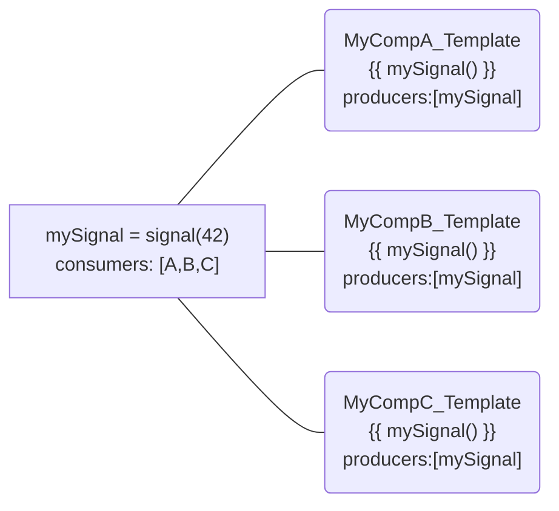
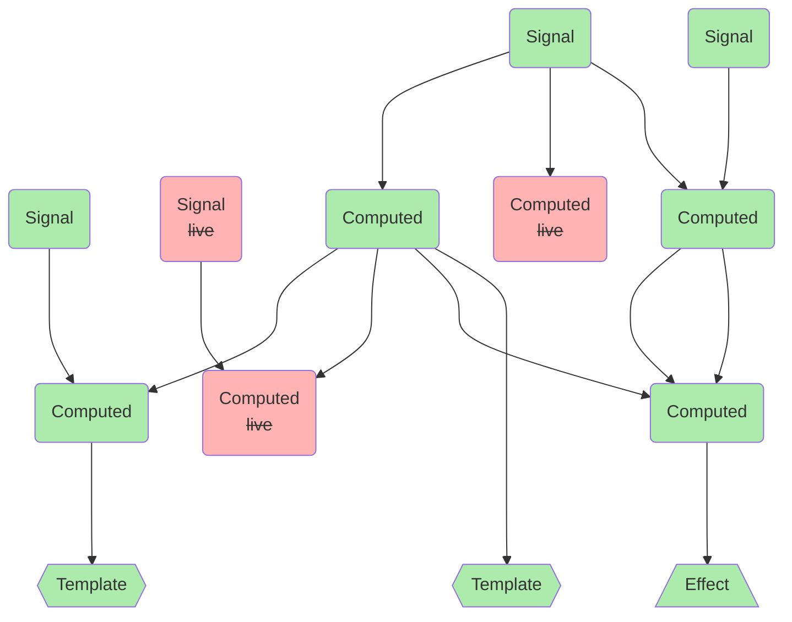

Just few days until the v17 release, let's discuss about Signals !

## Let's talk about signals

To get started, let's explore the concept of signals. For a concise introduction, I'll quote the [official docs](https://angular.io/guide/signals):

> Angular Signals is a system that granularly tracks how and where your state is used throughout an application, allowing the framework to optimize rendering updates.

To achieve this tracking, Signals implement a producer/consumer pattern. Where each `Signal` acts as a producer, and the templates calling them function as consumers.

```ts
function signal<T>(initialValue: T) {
  const reactiveNode = {
    producerNodes: [],
    consumerNodes: [],
    value: initialValue;
  }
  const getter = (() => {
                   producerAccessed(reactiveNode);
                   return reactiveNode.value;
                 });
  (getter as any)[SIGNAL] = reactiveNode;
  return getter;
}
```

In essence, a `Signal` is a callable object that serves two primary purposes:

* Notifies the reactive tree that the signal is being read
* returns its value  

Both regular and computed Signals, along with templates, are considered ReactiveNodes. A ReactiveNode is an object that maintains a list of consumers and knows its producers.

When a signal is invoked within a reactive context, such as a template execution, the `producerAccessed()` function registers the consumer (the template) with the producer (the signal) and the consumer retains a reference to its producer.



In a sense, templates subscribe to signals when they call them. Thus, when a signal is updated, it can notify every consumer and mark them as "dirty". When the consumer is a template, this process is equivalent to invoking `changeDectectorRef.markForCheck`. This ensures that your template will undergo change-detection in the next CD (Change Detection) cycle.

Now, what happens when a template is destroyed? Do you need to manually subscribe to your signal?

Of course not ! The Angular framework handles signal unregistration for us. Just like the `AsyncPipe` automatically subscribes and unsubscribes to an `Observable`, it manages the subscription and unsubscription of signals!

When a component is destroyed, or when a part of a template is removed (e.g., when an `ngIf` or `@if` condition becomes false), the `consumerDestroy` function is invoked. The consumer, which maintains a reference to its producers, notifies them to be removed from their consumer lists.

As simple as that we have the seamless subscription/unsubscription of signals!

### What about `computed` signals ?

The `computed()` function, allows us to compose signals. The callback of that function is also a reactive context. This means 2 things :

* the computed Signal is a consumer of the 1+ signals invoked in its callback
* ths computed Signal is a producer for whatever consumer that will invoke it

Without going into too much details, the framework makes a distinction between live and non-live consumer.

A `effect()` or a template are always live consumers: there is no situation where they doesn't want updates from their producers.
On the contrary of a computed signal which is only live if it is consumed by another live consumer.

A non-live computed signal will not react to producer updates and not mark its consumers as dirty.

The producer-consumer relation between nodes builds a real dependency graph that is driven by active consumers. If there is at least one active child consumer at one end of the graph, nodes will compute their values. If not, compute time is spared.



This is how a reactive graph could look like with live and non-live signals depending on the leaf consumers !

### Going onward from here

You see that with signals we enable the possibility of have a push-based change detection.  When a signal is updated, change detection occurs.

This is a significant step towards going "zoneless", although CD scheduling still requires `zone.js` at present. On signal updates templates are marked as dirty but not immediately change-detected. Invoking `detectChanges` on every signal update is not a viable solution here for performance reasons (imagine 10 updated signals triggering 10 CD cycles).

While this topic is pretty much a WIP, some exciting changes are already underway!

For instance, [this PR](https://github.com/angular/angular/pull/52302) introduces a new approach to partial change detection. Instead of marking every parent for CD (as `markForCheck` does, being called recursively up to the root component), it only registers the component requesting CD and skips the parents. This is what `markAncestorsForTraversal` accomplishes.

## Let's talk about Observables

When working with signals, you'll often interact with `Observables`. Interoperability between these 2 universes is provided by methods like `toSignal` for converting an `Observable` to a `Signal`.

As you already know, the only way to read values from an `Observable` is to `subscribe()` to it.

This is exactly what toSignal does, as demonstrated in the basic implementation:

```ts
export function toSignal<T>(source: Observable<T>, option: {initialValue: T}): Signal<T> {
  const state = signal<T>(options);

  source.subscribe({
    next: value => state.set(value),
  });
```

But how does the observable get unsubscribed?

In an [previous article](blog/2023-09-30-lazy-loading-mockable), I discussed a feature introduced in v16: [`DestroyRef`](https://angular.io/api/core/DestroyRef). `DestroyRef` allows you to set callbacks for cleanup or destruction behavior. The callback registered using `DestroyRef.onDestroy()` is executed when the injector it is called on is destroyed.

Once again, the framework takes care of the unsubscribe operation for us, as shown in the updated implementation:

```ts
export function toSignal<T>(source: Observable<T>, option: {initialValue: T}): Signal<T> {
  const state = signal<T>(options);

  const sub = source.subscribe({
    next: value => state.set(value),
  });

  cleanupRef?.onDestroy(() => sub.unsubscribe());
```

Reactive effects rely on the same mechanism to notify their producers of their destruction. `DestroyRef.onDestroy` triggers the `destroy()` method of the watcher behind the `effect()`.

However, it's important to note that, similar to `takeUntilDestroy`, `DestroyRef.onDestroy()` is only called when the injector is destroyed. When you call `toSignal()` in a component, the injector is the `NodeInjector`, which is destroyed along with the component. But if `toSignal()` is called in a service with `providedIn: 'root'`, the injector is the root injector, which is almost never destroyed. So, be cautious of this behavior.

### References

* [`producerAccessed()`](https://github.com/angular/angular/blob/d82d58621ecc3ec4dfc40bccdb9daa7e646788e2/packages/core/primitives/signals/src/graph.ts#L185C40-L185C40)
* [`consumerDestroy()`](<https://github.com/angular/angular/blob/d82d58621ecc3ec4dfc40bccdb9daa7e646788e2/packages/core/primitives/signals/src/graph.ts#L372>)
* [`markAncestorsForTraversal()`](https://github.com/angular/angular/blob/d82d58621ecc3ec4dfc40bccdb9daa7e646788e2/packages/core/src/render3/util/view_utils.ts#L222C27-L222C27)
* [`toSignal()`](https://github.com/angular/angular/blob/d82d58621ecc3ec4dfc40bccdb9daa7e646788e2/packages/core/rxjs-interop/src/to_signal.ts#L96)

Also on the topic of signals, if you're interested in the implementation behind it. I really recommand the [live coding session of Rainer Hahnekamp](https://www.youtube.com/watch?v=6wWteAza_FY), where he reimplements signals which helps understand how they work. I will be worth your time !
