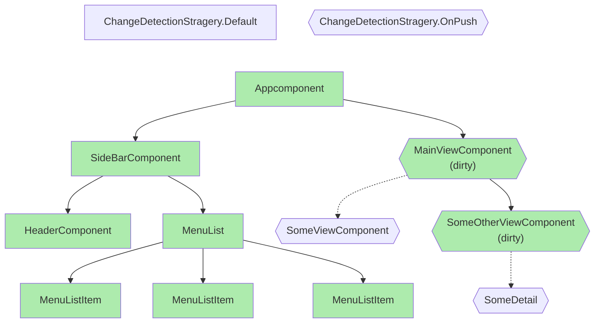
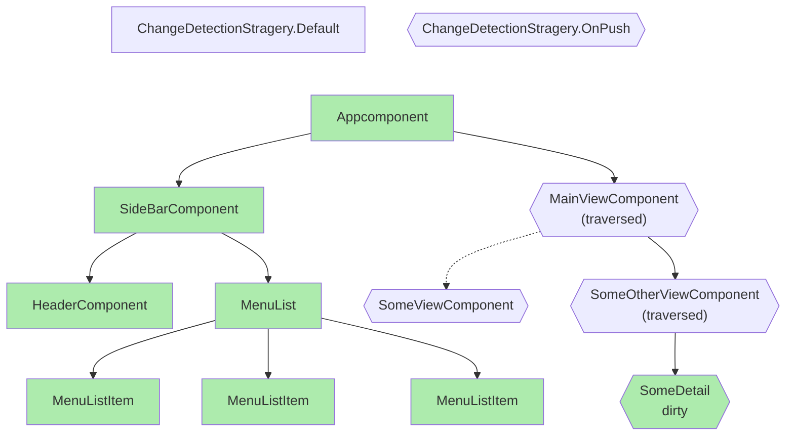

Angular v16 has introduced `Signal`, a brand new API destined to introduce fine grained reactivity in Angular Applications.

In v17, the signals APIs are promoted to stable (except `effect()`), so let's have a look at where we are with change detection in the latest version.

## Existing Change-Detection mechanism

Since its inception, Angular relies on `zone.js` and `NgZone` to schedule change detection by calling `ApplicationRef.tick()`.
This function is responsible for starting Change detection at the root component.

Starting at the root component, the change detection process examines every component in the component tree. It checks components that are marked as "dirty" and those that use the default change detection strategy. This comprehensive approach ensures that changes are detected and propagated through the entire component hierarchy as needed, maintaining the integrity of the application's data flow and user interface.

This change detection approach is global. The algorithm walks down (almost) every branch of the tree.

In this diagram, all green components (also pointed by a plain arrow) are being checked for changes. `SomeViewComponent` or `SomeDetail` aren't because they use the `OnPush` strategy and weren't marked as dirty.

Components are marked dirty recursively up to the root component by calling `changeDetectorRef.markForCheck()` on a given component. This is what, among others, the `AsyncPipe` does. In our example `SomeOtherViewComponent` marked itself and its parents as dirty.

For more insights into all the change detection details you can have a look into [this article by Antonio Pekeljević](https://medium.com/@antoniopk/angular-change-detection-explained-169aea595423).

## v17 introduces local change detection

Signals were introduced to make local change detection possible. In v16, a live signal (a signal called in a template), when updated via `Signal.set()`, `Signal.mutate()` or a `computed()` signal did mark the component as dirty. Components are marked dirty via calling the internal [`markViewDirty()`](https://github.com/angular/angular/blob/e092184a5c3d98f4be329e4037c9039c1b420d75/packages/core/src/render3/reactive_lview_consumer.ts#L62) function. This is the same function that is called by `changeDetectionRef.markForCheck`.

In v17, this function call has been replaced by [`markAncestorsForTraversal()`](https://github.com/angular/angular/blob/83a3b85c355f6cb9f9b698bd90c2920341466032/packages/core/src/render3/reactive_lview_consumer.ts#L49).

The key distinction between these two functions is that `markViewDirty` extends its "dirty" marking to all ancestor components in a recursive manner, whereas `markAncestorsForTraversal`` confines the "dirty" marking to the current component and schedules its ancestors for future traversal without immediate change detection.

So while still relying on a tree based change detection, we now have access to a "glocal" (global + local) change detection :

* It still starts from the root component (hence the global)
* Component with the default strategy will still be checked
* OnPush component will still be checked only if dirty
* But we can now mark a single component as dirty (hence the local)

If you rely heavily on using the `OnPush` strategy, this global approach will hugely decrease the number of components that will be checked by change detection.

As of 17.0, this local change detection is only available when using `Signals`. `markAncestorsForTraversal` is a private API.

This updated example shows the glocal/hybrid change detection system. Change detection remains unchanged on default strategy components and signals allow the new local change detection on OnPush components.

## Change Detection Demo

A few years ago (v8 times) [Daniel Wiehl](https://github.com/danielwiehl/edu-angular-change-detection) wrote an awesome live demo showcasing various facets of change detection in Angular. This demo covered when change detection occurs, what precisely happens during the process, and where it takes place.

With the evolution of Angular and the introduction of new features like local change detection powered by signals, we can now have an updated demo that incorporates these recent changes and enhancements.

You can play with it right here: 🚦 [Awesome demo](https://jeanmeche.github.io/angular-change-detection/)🚦.

## About the future

As mentioned earlier, `NgZone` is still pretty much the scheduler for automatic change direction : `zone.js` patched APIs are queuing microtasks and once the microtasks queue is empty, `NgZone` invokes `tick()`.

To achieve true local change detection, it will be necessary to design and implement a new scheduler. This new scheduler can pave the way for official support for zoneless applications, which has been highly anticipated.

In the meantime, I recommend exploring the [RxAngular](https://www.rx-angular.io/) library, which offers tools and solutions for working with zoneless applications. This library can be a valuable resource for developers looking to navigate the intricacies of change detection and performance optimization in Angular applications.
