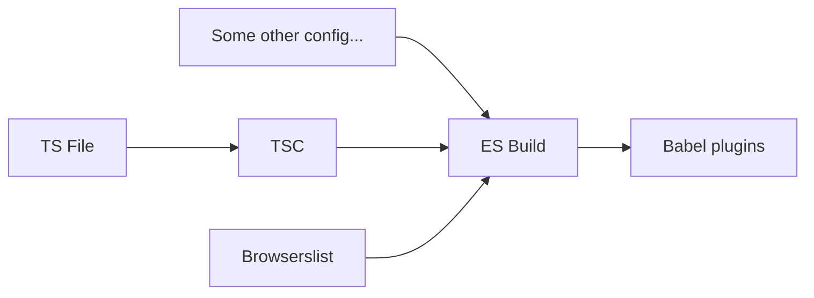

If you follow me a bit on the social networks, you've probably see me writing about [private class properties](https://developer.mozilla.org/en-US/docs/Web/JavaScript/Reference/Classes/Private_properties) and their downside.

Here is a private properties and a property with a typescript `private` attribute.

```ts
class Foo {
  #myPrivateFoo = 'foo'; // not accessible outside the class
  private notSoPrivateFoo = 'foo'; // accessible at runtime outside the class
}

```

Let's dig into why one need to be carefull before using private properties.

## Performance pitfalls

Currently the [Google Typescript Style Guide](https://google.github.io/styleguide/tsguide.html#class-members) is pretty explicit and recommend not using private class properties.

> Do not use private fields (also known as private identifiers)
>
> Private identifiers cause substantial emit size and performance regressions when down-leveled by TypeScript, and are unsupported before ES2015. They can only be downleveled to ES2015, not lower. At the same time, they do not offer substantial benefits when static type checking is used to enforce visibility.

Here is a bit of explanation, by comparing typescript and the javascript output in `ES2021` by esbuild. (`ES2021` is the last target to not support private properties).

#### `Typescript class`

```ts
class Foo {
 #bar = 'bar';

   constructor() {
     this.#bar
   }
}
```

#### `Downleveled javascript class`

```js
// Helpers functions

var __typeError = (msg) => {
  throw TypeError(msg);
};
var __accessCheck = (obj, member, msg) => member.has(obj) || __typeError('Cannot ' + msg);
var __privateGet = (obj, member, getter) => (
  __accessCheck(obj, member, 'read from private field'), getter ? getter.call(obj) : member.get(obj)
);
var __privateAdd = (obj, member, value) =>
  member.has(obj)
    ? __typeError('Cannot add the same private member more than once')
    : member instanceof WeakSet
    ? member.add(obj)
    : member.set(obj, value);

// Class Impl

var _bar;
class Foo {
  constructor() {
    __privateAdd(this, _bar, 'bar');
    __privateGet(this, _bar);
  }
}
_bar = new WeakMap();

```

[Live example by Esbuild](https://esbuild.github.io/try/#YgAwLjIxLjMALS10YXJnZXQ9ZXMyMDIxAGUAZW50cnkuanMAY2xhc3MgRm9vIHsKICNiYXIgPSAnYmFyJzsKCiAgIGNvbnN0cnVjdG9yKCkgewogICAgIHRoaXMuI2JhcgogICB9Cn0K).

As you can see, downleveling the private properties is responsible for introducing a `WeakMap` into the javascript implementation. This is responsible for the performance regressions mentioned earlier.

## Angular, Build target and browser support

> Edit Jan 2024: The following paragraph applies until v18. 

Starting with Angular 15, the Angular CLI forces the typescript target to `ES2022`. This means the typescript compiler (`tsc`) output does not downlevel private properties.

So why are private fields still not recommended ?

Let go back to how the Angular CLI and the application builder work:



When using the application builder, esbuild processes the JavaScript output from `tsc` along with a browserslist configuration.

The default browserslist configuration used by the CLI is following:

```text
last 2 Chrome versions
last 1 Firefox version
last 2 Edge major versions
last 2 Safari major versions
last 2 iOS major versions
Firefox ESR
```

[Source](https://github.com/angular/angular-cli/blob/7a539ab39ca3e0f70b3cf3b12da5a024cde72865/packages/angular/build/src/utils/supported-browsers.ts#L15-L21)

At the time of writing, this results in the following browser support:

```text
 'chrome124.0', 'chrome123.0',  'edge123.0',
  'edge122.0',   'firefox125.0', 'firefox115.0',
  'ios17.4',     'ios17.3',      'ios17.2',
  'ios17.1',     'ios17.0',      'ios16.6',
  'ios16.5',     'ios16.4',      'ios16.3',
  'ios16.2',     'ios16.1',      'ios16.0',
  'safari17.4',  'safari17.3',   'safari17.2',
  'safari17.1',  'safari17.0',   'safari16.6',
  'safari16.5',  'safari16.4',   'safari16.3',
  'safari16.2',  'safari16.1',   'safari16.0'
```

[Browserlist compatible browser](https://browsersl.ist/#q=last+2+Chrome+versions%0Alast+1+Firefox+version%0Alast+2+Edge+major+versions%0Alast+2+Safari+major+versions%0Alast+2+iOS+major+versions%0AFirefox+ESR).

Esbuild has a basic understanding of which features a browser supports and is able to downlevel to match the supported browsers.

For example if you replace `--target=safari16` by `--target=safari15`, you'll see that your private properties will be downleveled when using the latter. [Demo here](https://esbuild.github.io/try/#YgAwLjIxLjMALS10YXJnZXQ9c2FmYXJpMTYAZQBlbnRyeS5qcwBjbGFzcyBGb28gewogI2JhciA9ICdiYXInOwoKICAgY29uc3RydWN0b3IoKSB7CiAgICAgdGhpcy4jYmFyCiAgIH0KfQo).

But... why are my private properties downleveled with the default config if every browser on the list supports private properties ?

## Angular specifics & partial Safari support

While Safari supports private properties, there is a known issue with Safari < 16.4 when they are used alongside static class blocks.

#### `A class with a static block`

```javascript
class Foo {
 static { this.foo = undefined }
 #bar = 'bar';
}
```

[Demo on esbuild](https://esbuild.github.io/try/#YgAwLjIxLjMALS10YXJnZXQ9c2FmYXJpMTYAZQBlbnRyeS5qcwBjbGFzcyBGb28gewogc3RhdGljIHsgdGhpcy5mb28gPSB1bmRlZmluZWQgfTsKICNiYXIgPSAnYmFyJzsKCiAgIGNvbnN0cnVjdG9yKCkgewogICAgIHRoaXMuI2JhcgogICB9Cn0K).

When they are used together, Esbuild is working around the limitation by downleveling the private properties.

### Static blocks by Angular

You're likely aren't using static class blocks yourself, but you have to know that Angular does it for you.
The component factory `ɵfac` or the component metadata definitions `ɵcmp` are defined in static blocks.

#### `Angular Component`

```ts
@Component({
  selector: 'app-root',
  standalone: true,
  ...
})
export class AppComponent {
  #foo = 'foo';
}
```

#### `Compiler output`

```javascript
class AppComponent2 {
  #foo = "foo";
  static {
    this.ɵfac = function (t) {
      return new (t || AppComponent2)();
    };
  }
  static {
    this.ɵcmp = ɵɵdefineComponent({
      selectors: [["app-root"]],
      standalone: !0,
      ...
    });
  }
}
```

So when Safari 16 needs to be supported, Esbuild will downlevel the private properties.

This specific example is why, as of today (and until Safari 16 is outside of the scope support), private properties are not recommended in an Angular project.

## Enable native private properties on Angular

If you'd like to work around the default behavior of the Angular CLI, you can already opt-out of the Safari 16 support by overriding the default browserslist config:

#### `.browserslistrc`

```text
last 2 Chrome versions
last 1 Firefox version
last 2 Edge major versions
last 1 Safari major versions
last 1 iOS major versions
Firefox ESR
```

## Bonus

If you'd like to investigate a bit more your bundle output, I recommend you building you apps by disabling the mangling.

```
NG_BUILD_MANGLE=0 ng build
```

This way you'll be able to keep all you variable & class names while still enabling optimizations like tree shaking and dead-code elimination (DCE).

## Since v19

Since v19, or more precisly since browserlist updated the definitions of "last 2 iOS major versions" to exclude v16, this happened around mid-septembre with the release iOS 18, the default configuration of the Angular CLI doesn't not downlevel private properties anymore. If you rely on that default configuration you can safely use private properties and enjoy the smal performance improvements it brings in !