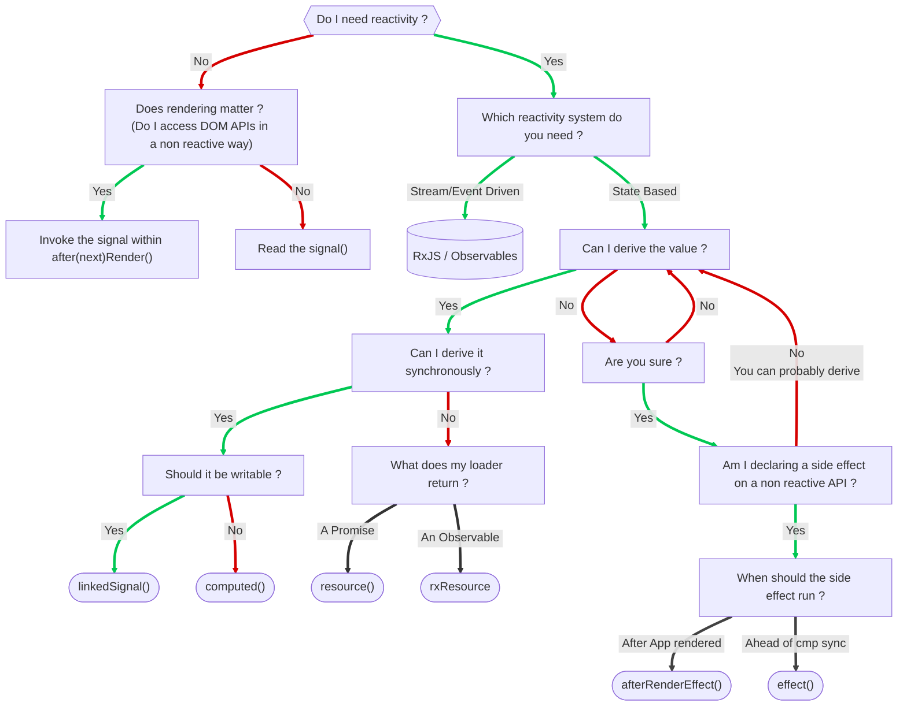

In Angular v16, signals were introduced as a new reactive primitive to enhance state management and streamline change detection. Signals are functions that hold a value and emit updates when that value changes, enabling fine-grained reactivity without relying on manual subscriptions or complex observables.

With this solid foundation layed out with `signal()`, `computed()` and `effect`, additional primitives we're introduced in the following minor/major versions. 

Amongst other we have today: 
* `input()`, for inputs
* Signal Queries (`viewChild()`, `viewChildren`, `contentChild()`, `contentChildren()`)
* `model()` for double binding 
* `linkedSignal`
* `resource`/`rxResource`
* `afterRenderEffec()` 

Each of those primitives provided by the framework addresses specific usecases. It can become difficult to determine which is the exact tool you are looking for.

Here is a chart that might help you determine what is the tool that your are looking for. 

<!-- 

-->

As you can see, this chart assumes that you already know when to reach out for Signals and when/what observable is better suited. 

Note: I'll try to keep this chart up-to-date with new primitives that might be around the corner or when new use cases arrise. 
