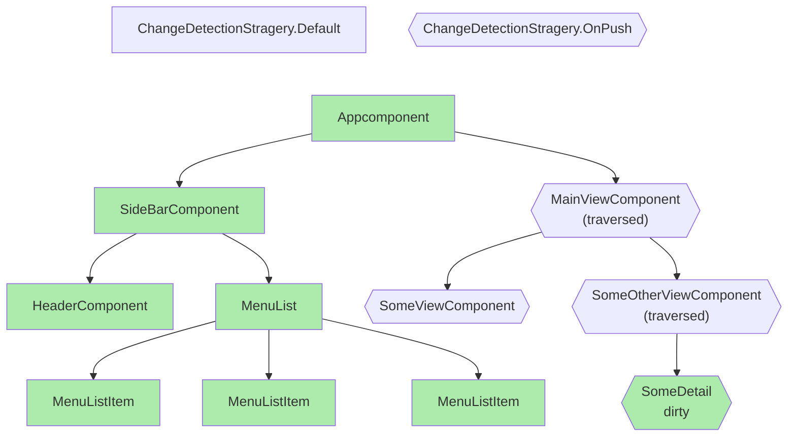

Web frameworks like Angular were created to abstract the complexities of direct DOM manipulation, providing developers with a more declarative and efficient way to build dynamic user interfaces. Directly interacting with the DOM using native JavaScript APIs can be cumbersome, error-prone, and slow, as DOM operations are inherently expensive in terms of performance. These frameworks introduce layers of abstraction, such as Angular's declarative templating or React's Virtual DOM, to optimize how changes are applied to the DOM. By batching updates, minimizing direct DOM interactions, and leveraging diffing algorithms, frameworks significantly improve rendering performance and developer productivity. Ultimately, they bridge the gap between the imperative nature of DOM APIs and the declarative, component-based approach that modern web development demands.

In a nutshell, it's the framework's job to perform as few DOM operations as possible to keep. This article will delve into the different strategies used by Angular to optimize DOM manipulations.

## Angular's approach to rendering: declarative templating

Back in 2019 the Angular team presented Ivy, its new rendering engine. As an aside the story of Ivy is mentioned in the [Angular Documentary by Honeypot](https://www.youtube.com/watch?v=cRC9DlH45lA).

The idea behind Ivy, is that every component template is compiled into a set of javascript instructions that are part of a template function.

<div style="display:flex; flex-direction: row; gap: 16px; flex-wrap: wrap">

<div style="flex:1; min-width: 200px;">

#### `A basic component template`

```html
<div>
  this is a div, with a value: {{ myValue }}
</div>
```

</div>
<div style="flex:1; min-width: 200px;">

#### `Its instruction representation`

```js
function MyComponentTemplateFn(rf, ctx) {
  if (rf & 1) {
    /* creation mode */
    ɵɵelementStart(0, 'div');
    ɵɵtext(1);
    ɵɵelementEnd();
  }
  if (rf & 2) {
    /* update mode */
    ɵɵadvance();
    ɵɵtextInterpolate1('this is a div, with a value: ', ctx.myValue, '');
  }
}
```

</div></div>

You can test this by yourself with this [demo I built](https://jeanmeche.github.io/angular-compiler-output/), which shows all the instructions for any angular template you could write.

We notice that the template function is split into 2 phases.

- A creation mode
- An update mode

### Creation mode

The creation mode of a template function is the phase where the framework initializes and creates the DOM structure for a component or template.
During this mode, Ivy executes a series of template instructions to construct the component's view, including creating DOM elements, binding attributes, and setting up initial data bindings.

The creation mode is essentially the first step in the rendering process, where the component's template is transformed into a live DOM representation.

In our previous example, it creates 2 nodes: a DIV node that contains an (empty for now) TEXT node.

### Update mode

Once the creation mode completes, Angular transitions to the update mode, where it handles changes to the component's state and updates the DOM accordingly. This separation of creation and update modes allows Ivy to optimize performance by only applying changes when necessary, rather than recreating the entire DOM structure.

In our previous example, it updates the text node with the content of the text interpolation.

### Visual illustration & cues of DOM changes

It is possible to visualize the difference between the creation and the update mode.
For example Chrome DevTools have a feature in the rendering tab to flash DOM elements that are being updated.


<hr>

Once this feature is enabled, let'ss build a basic example with a static DIV and a dynamic one.

<div style="display:flex; flex-direction: row; gap: 16px">

<div style="flex:1; min-width: 200px;">

#### `Component with its template`

```typescript
@Component({
  template: `
    <div>This is static</div>
    <div>This is updated {{ sig() }}</div>
  `,
})
export class AppComponent {
  sig = signal(0);

  constructor() {
    setInterval(() => {
      this.sig.update((v) => v + 1);
    }, 1000);
  }
}
```

</div>
<div style="flex:1; min-width: 200px;">

#### `Compiled template function`

```js
function MyComponentTemplateFn(rf, ctx) {
    if (rf & 1) {
      ɵɵelementStart(0, 'div');
      ɵɵtext(1, 'This is static');
      ɵɵelementEnd();
      ɵɵelementStart(2, 'div');
      ɵɵtext(3);
      ɵɵelementEnd();
    }
    if (rf & 2) {
      ɵɵadvance(3);
      ɵɵtextInterpolate1('This is updated ', ctx.sig(), '');
    }
},
```

</div></div>

The template create 2 DIVs. 
1. one with only static nodes created during the creation mode.  
2. one with an interpolation that is computed during the udpdate mode

The signal is updated every second and the framework schedules a sync to re-execute the template function.


We see that on update, both DIVs are unaffected by the execution of the template function. Only the TEXT node of the dynamic DIV gets updated with the new value of the interpolation.

[Stackblitz Demo](https://stackblitz.com/edit/angular-incremental-dom-blink).

### Repeater and node reusage

Angular's `@for` block, introduced in v17 alongside the @-block control flow syntax, is designed to efficiently render lists by reusing DOM nodes whenever possible.

This optimization is made even more powerful with the track function, which allows developers to specify a unique identifier for each item in the list. By providing a track function, Angular can intelligently track changes to the list and determine which DOM nodes can be reused, rather than recreating them from scratch. This approach minimizes unnecessary DOM manipulations, improves rendering performance, and ensures smoother updates, especially in dynamic lists where items are frequently added, removed, or reordered. The track function is a simple yet impactful feature that underscores Angular's commitment to performance and developer-friendly APIs.

## Timing of the template rendering

Now you know that to update the DOM, Angular runs the template functions of our components. But when and which template function run ?

Angular's synchronization mechanism (previously known as Change Detection or CD), navigates through the components tree and runs the template function of components that need to be sync'd.

Depending on the ChangeDetection strategy, a component is always checked (`Default`) or checked only if it has been marked as dirty (`OnPush`).



In modern apps, the concept of dirtiness of a component is mostly driven by signals and the reactivity trees. A signal that gets updated will mark the component that use them as dirty.

You can see here a second performance optimization at play.
With `OnPush`, only components which the framework knows are dirty are going to be sync'd. Others are skipped, sparing some CPU time.

## Memoization and dirty checking

Now that we've seen that Angular only updates dynamic content and only runs it for dirty components (Reactivity Tree), we can look into one last layer of optimization : Memoization and dirty checking.

If we look back at a template function with a dynamic expression like interpolations

```typescript
function MyComponentTemplateFn(rf, ctx) {
    if (rf & 1) {
        ...
    }
    if (rf & 2) {
      ɵɵadvance(3);
      ɵɵtextInterpolate1('This is updated ', ctx.sig(), '');
    }
}
```

We can see that even if the interpolation is dynamic, it is part of a larger template function.
That function may run even if that interpolation doesn't see any update (but other interpolation might).

For those cases, Angular will always memoize the result of interpolation.
When running that particular instruction, it will check the previous result of the interpolation and will update the DOM only if the value (a string) has changed.

This prevents further more costly but unnecessary DOM manipulations.

## Afterword

Angular's declarative templating and view-based reactive rendering represents a significant leap forward in rendering performance and efficiency. By focusing on incremental updates and direct DOM manipulation, Angular has streamlined how applications are built and maintained, offering developers a more optimized and intuitive way to create dynamic user interfaces. While frameworks like React have popularized the Virtual DOM approach, Angular's declarative approach demonstrates that there are multiple paths to achieving high-performance web applications.

As web development continues to evolve, Angular's commitment to innovation—evidenced by features like its approach to templates—ensures that it remains a strong contender in the ecosystem. Whether you're building small projects or large-scale enterprise applications, understanding these rendering strategies empowers you to make informed decisions and leverage the best tools for your needs. The future of Angular looks bright, and its templating approach is a testament of the great design choice that have been maid along the way.

## Notes

Alex Rickabaugh [presented at NgGlühwein 2024](https://www.youtube.com/watch?v=uTqu_eR80ss&t=1s), the mindset shift that lead the team to rethink its vision of the ChangeDetection process that is now viewed as a synchronization process between the model and the DOM.

In the first version of the article, Angular's rendering strategy was described as being "Incremental DOM". I was made aware that Incremental DOM is actually a different rendering strategy. Incremental DOM is a bit like VDOM but no intermediate tree is created and diffing happens against the actual DOM. More info Google's [incremental-dom library](https://google.github.io/incremental-dom/)